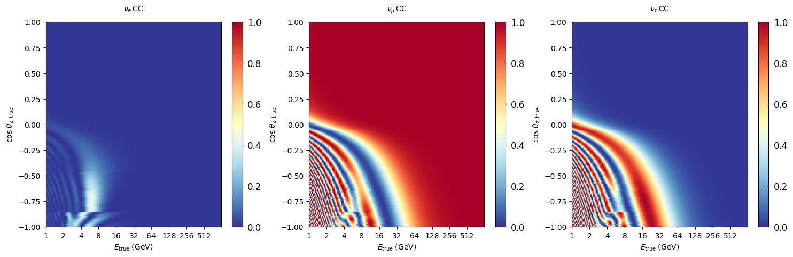

[](https://github.com/icecube/pisa/actions/workflows/pythonpackage.yml)
[](https://github.com/icecube/pisa/pulls)
[](https://github.com/icecube/pisa/pulse)
[](https://github.com/icecube/pisa/graphs/contributors)
[](https://github.com/icecube/pisa/stargazers)

[Introduction](pisa/README.md) |
[Installation](INSTALL.md) |
[Documentation](https://icecube.github.io/pisa/docs) |
[Terminology](pisa/glossary.md) |
[Conventions](pisa/general_conventions.md) |
[License](LICENSE)

PISA is a software written to analyze the results (or expected results) of an experiment based on Monte Carlo (MC) simulation.

In particular, PISA was written by and for the IceCube Collaboration for analyses employing the [IceCube Neutrino Observatory](https://icecube.wisc.edu/), including the [DeepCore](https://inspirehep.net/literature/929836) and the [Upgrade](https://inspirehep.net/literature/2970027) low-energy in-fill arrays.

> [!NOTE]
> However, any experiment can make use of PISA for analyzing expected and actual results.

PISA was originally developed to perform statistical inference on low-statistics Monte Carlo sets using histogram-based operations, parameterizations, and smoothing techniques. The framework has evolved to support traditional event-by-event reweighting as its core capability, while its modular (data pipeline) design still enables complementary analysis techniques.

If you use PISA, please cite our publication ([e-Print available here](https://inspirehep.net/literature/1662485)):
```
Computational Techniques for the Analysis of Small Signals
in High-Statistics Neutrino Oscillation Experiments
IceCube Collaboration - M.G. Aartsen et al.
Mar 14, 2018
Published in: Nucl.Instrum.Meth.A 977 (2020) 164332
```

# Quick start

## Installation

For quick-start and detailed installation instructions see [Installation](INSTALL.md).

## Minimal example: [oscillograms](https://inspirehep.net/literature/735428) of neutrinos naturally produced in the Earth's atmosphere

Import PISA's `Pipeline` class and a plotting interface:


```python
from pisa.core import Pipeline
import matplotlib.pyplot as plt
```

Instantiate a `Pipeline` or multiple `Pipeline`s in a `DistributionMaker` using PISA config files:


```python
template_maker = Pipeline("settings/pipeline/osc_example.cfg")
```

Run the `Pipeline` with nominal settings:


```python
template_maker.run()
```

Get the oscillation probabilities $P_{\nu_\mu\to\nu_\beta}$ (Earth oscillograms):


```python
outputs = template_maker.data.get_mapset('prob_mu')
```

Plot them:


```python
plot_kwargs = {"titlesize": 16, "xlabelsize": 12, "ylabelsize": 12, "cmap": "RdYlBu_r", "vmin": 0, "vmax": 1}
fig, axes = plt.subplots(figsize=(18, 5), ncols=3)
outputs['nue_cc'].plot(ax=axes[0], title=r"$P_{\nu_\mu\to\nu_e}$", **plot_kwargs)
outputs['numu_cc'].plot(ax=axes[1], title=r"$P_{\nu_\mu\to\nu_\mu}$", **plot_kwargs)
outputs['nutau_cc'].plot(ax=axes[2], title=r"$P_{\nu_\mu\to\nu_\tau}$", **plot_kwargs);
```


    

    


# Containerization

In case you do not want to install PISA, we provide pre-built [Docker](https://docs.docker.com) images [here](https://github.com/orgs/icecube/packages?repo_name=pisa).

You can download a given image via `docker pull ghcr.io/icecube/pisa:<tag>`, where `<tag>` has to be replaced by the desired release tag or `master`.

Each image is built using the [Dockerfile](Dockerfile) included in PISA.

You can also use this file to containerize PISA yourself (with Docker or [Singularity](https://docs.sylabs.io/guides/latest/user-guide/)). Instructions can be found [here](https://github.com/icecube/wg-oscillations-fridge/blob/master/docs/CONTAINER_INSTRUCTIONS.md) (access restricted).

# Contributions

Contributors are listed specifically [here](CONTRIBUTORS.md), while the used external software is summarized [here](EXTERNAL_ATTRIBUTION.md).
